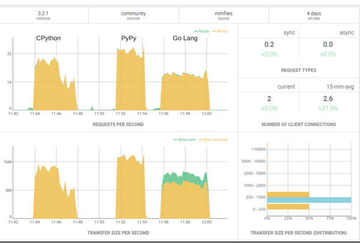
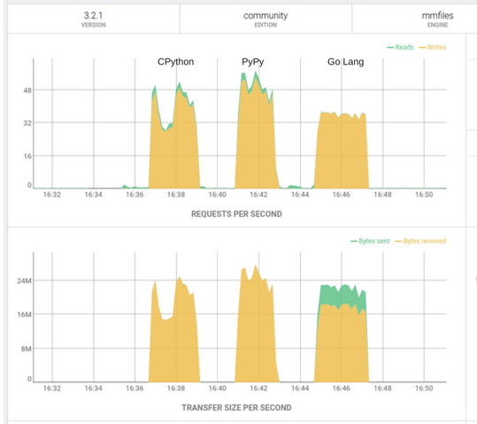

## Experimento 1 - Processamento Síncrono

O primeiro experimento, com scripts em Python e Go, faz a extração de dados de aquivos de log e a inserção dos dados em um banco de dados NoSQL (ArangoDB).

As premissas para o experimento são:

- Fazer a extração dos dados sem usar regex
- Fazer a inserção dos dados em lotes de 2000 registros
- Executar de forma sincrona

O uso de regex para a extração dos dados foi testada preveamente mas não apresentou boa performance e, por isso, foi descartada.

Foram feitos testes usando CPython (Python 3.5), PyPy2.7 (v5.8.0) e Go (v1.8.3). Todos os testes rodaram no mesmo hardware com OS Ubuntu 14.04, ArangoDB 3.2.1 local e processaram a mesma massa de dados.

A massa de dados consiste em 100 arquivos de log no formato texto, num total de 2,4G de dados (2402 mega).

Os tempos de execução foram obtidos com o comando `time` do sistema operacional. Os resultados foram:

Engine|Tempo de Exc|Total de registros no BD
-|------------|------------------------
CPython|3:50 min|10.560.341
PyPy|2:41 min|10.560.341
Go|4:25 min|10.560.341

Abaixo esta um print do painel de controle do ArangoDB onde é possível ver as taxas de requisições por segunto e de transferência de dados por segundo:

Dentre os 3 testes o PyPy foi o que conseguiu as melhores taxas de requisição e transferência por segundo.

## Experimento 2 - Processamento Assíncrono

Após os primeiros resultados e algumas sugestões para usar [goroutines](https://tour.golang.org/concurrency/1), foram criadas novas versões dos scripts, agora para processar os dados paralelamente.

As premissas para este experimento são:

- Fazer a extração dos dados sem usar regex
- Fazer a inserção dos dados em lotes de 2000 registros
- Executar de forma paralela.

Todas as versões foram mantidas, os dados foram mantidos, o ambiente do teste foi mantido, só havendo alteração no código.

No script Go foi usado as goroutines, como mencionado anteriormente. No script em Python foi usada a classe ProcessPoolExecutor do pacote concurrent.futures para atender a premissa de execução paralela e não apenas concorrente.

Os tempos de execução na versão paralela foram obtidos com o `time` como anteriormente. Os resultados foram:

Engine|Tempo de Exc|Total de registros no BD
-|------------|------------------------
CPython|2:15 min|10.560.341
PyPy|1:51 min|10.560.341
Go|2:26 min|10.560.341

Foi tirado um novo print do painel do ArangoDB onde podemos ver que a quantidade de requests por segundo e a taxa de transferencia tiveram um aumento considerável.

O PyPy continuou com a vantagem nos testes feitos com paralelismo, podemos ver que ele conseguiu as melhores taxas de requisição por segundo e transferencia por segundo. 

## Considerações

Por não ter experiência com a linguagem Go, é quase certo que existem várias oportunidades de otimização no script Go. Por isso peço que entrem em contato se souberem como otimizar o script em Go (e o script Python também!)
